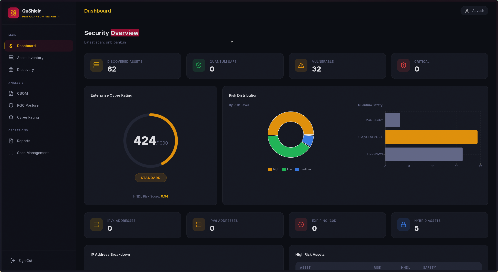
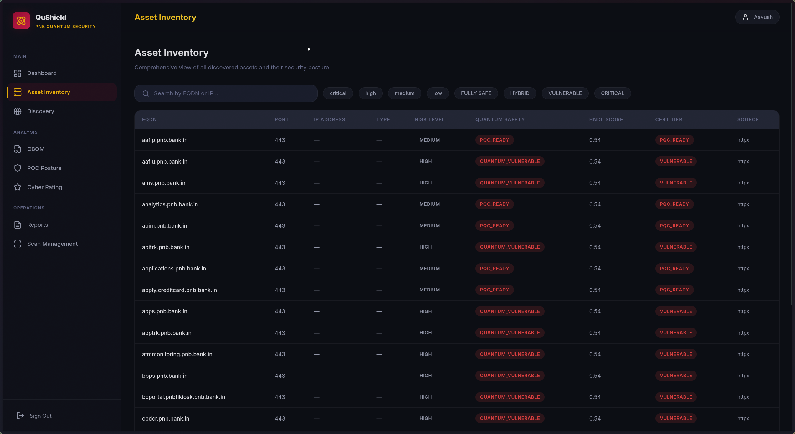
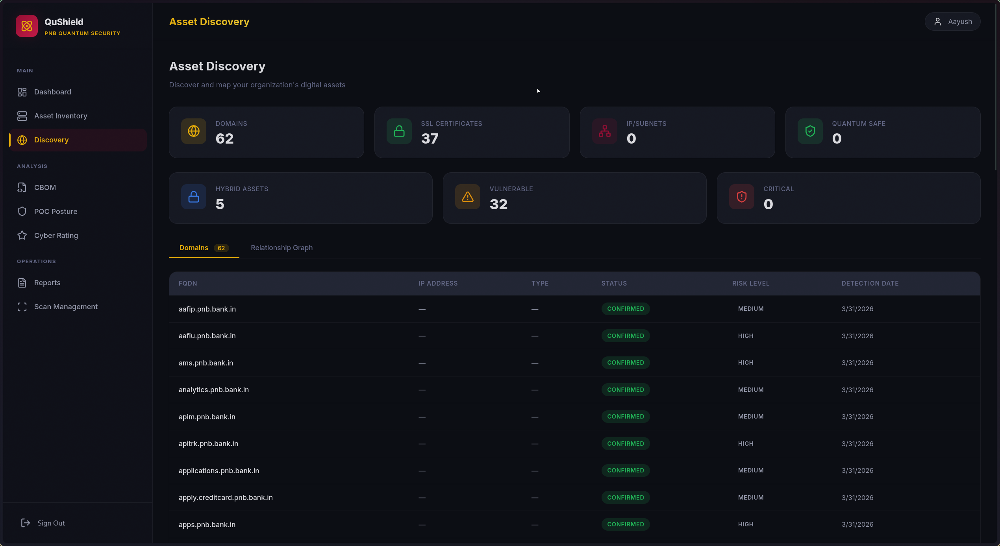
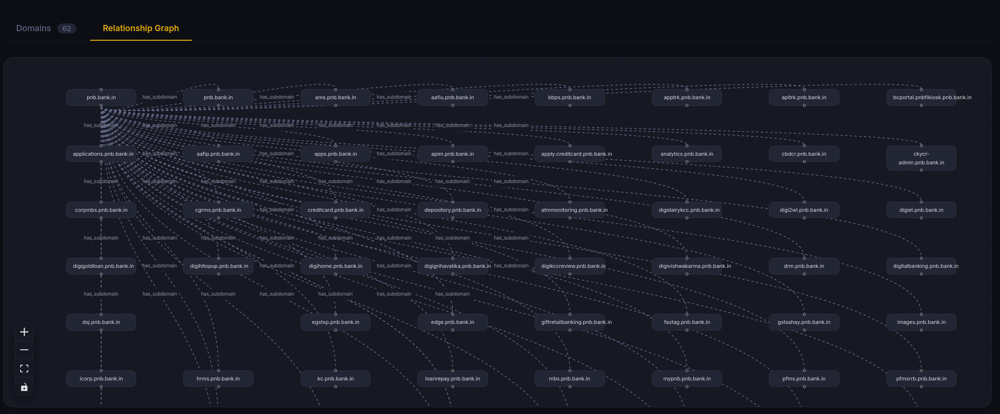
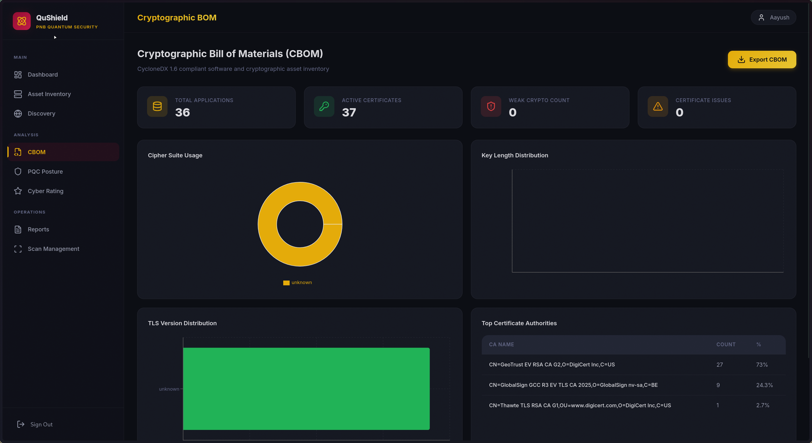
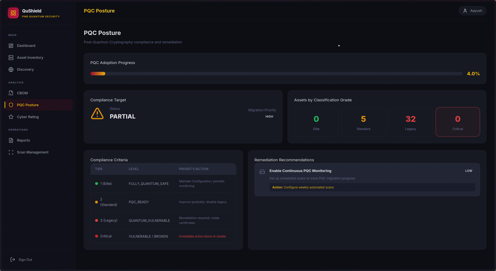
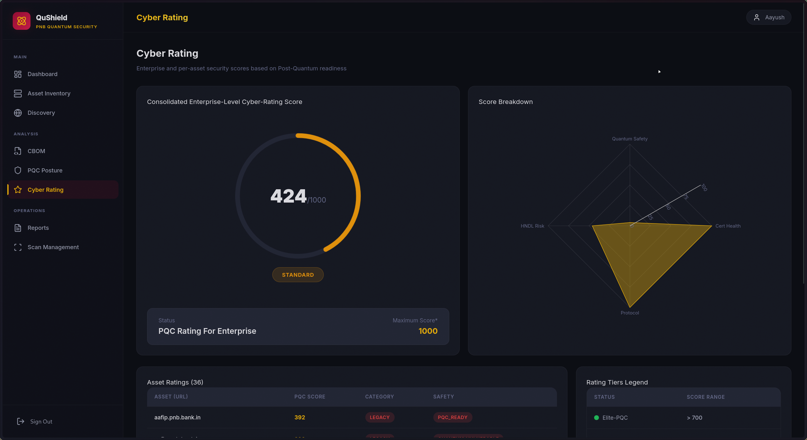
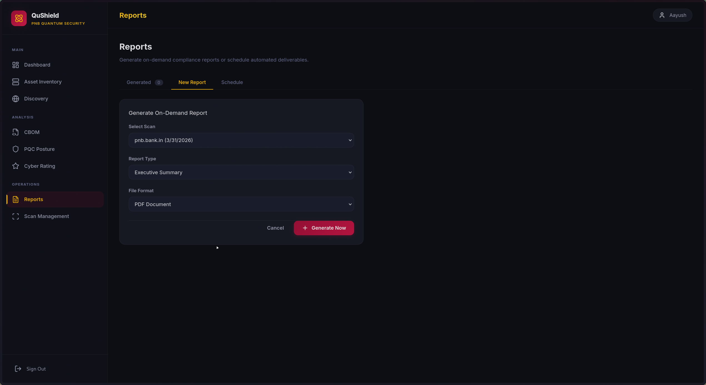
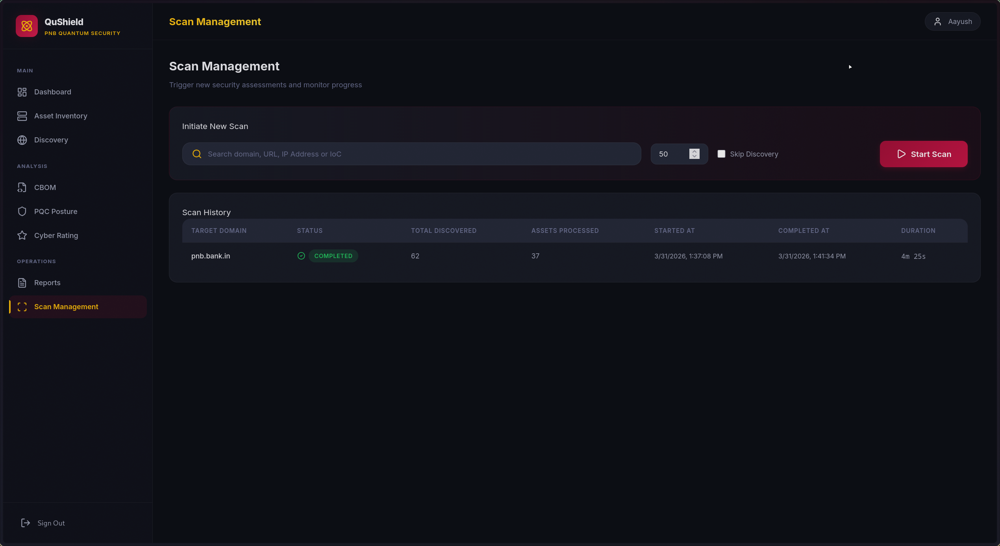
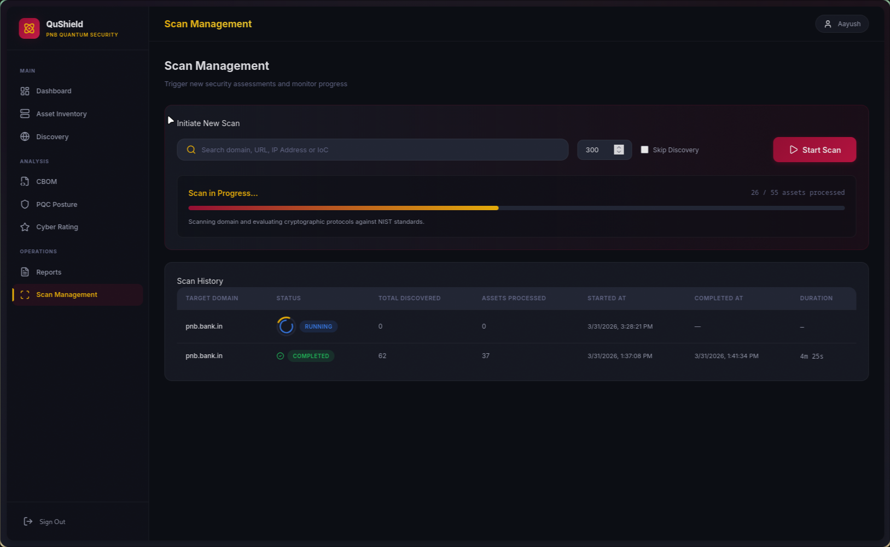

# QuShield
*(A QuRaccoons Project)*

Enterprise grade cryptographic posture management and Post-Quantum Cryptography (PQC) readiness assessment platform. QuShield IITK provides end-to-end visibility into cryptographic assets, automated risk scoring, and strategic guidance for quantum safe migration.














## Architecture & Technology Stack

QuShield IITK is architected with a decoupled, high performance stack designed to scale and seamlessly analyze complex organizational perimeters.

### Technology Blueprint

1. **Backend Application (`backend/`)**
   * **Framework**: FastAPI (0.109.0+) serving high concurrency REST endpoints.
   * **Database & ORM**: PostgreSQL (14+) for production and SQLite (3.x) for development, paired with SQLAlchemy and Alembic. The system relies on core relational data models including `Asset`, `ScanResult`, `CbomComponent`, `PqcCertificate`, and `RemediationAction`.
   * **Security**: Role based access control utilizing JSON Web Tokens (via `python-jose` and `passlib` bcrypt).
   * **Performance Benchmarks**: API response times under 5 seconds, and concurrent scan capacities designed for extreme horizontal scalability.
   
2. **Frontend Dashboard (`frontend/`)**
   * **Core**: React 19 driven by Vite for instantaneous Hot Module Replacement (HMR) and optimized production builds.
   * **State Management**: TanStack React Query for efficient asynchronous data fetching, caching, and synchronization.
   * **Visualizations**: Complex threat modeling is rendered using Recharts and `@xyflow/react` (React Flow) for interactive timeline and architecture visualizations.

3. **QuShield Core Engine (`qushield/`)**
   * **Orchestration**: A strictly typed Python (3.11+) asynchronous engine orchestrating a comprehensive 4-layer scanning workflow.
   * **Network & Crypto Probing**: Integrates `Nmap`, `httpx`, `SSLyze` for TLS/SSL analysis, `ike-scan` for VPN discovery, and dedicated `pqcscan` tooling.
   * **Quantum SDKs**: Utilizes `liboqs` (0.10.0+) for advanced ML-DSA-87 signature parsing and PQC capability discovery.
   * **Speed**: Single endpoint scan completion time strictly bounded to under 20 seconds.


## The 4-Layer Scanning Workflow

The `qushield` core Python engine operates on a sophisticated, multi-layered deterministic pipeline that moves assets from raw discovery to cryptographic certification.

### Layer 1: Asset Discovery
The engine identifies the attack surface footprint for a given target domain in under 60 seconds. It utilizes Certificate Transparency (CT) logs and active subdomain enumeration to build a comprehensive list of live endpoints dynamically. 

### Layer 2: Deep TLS & VPN Scanning
Discovered valid endpoints are routed to the internal TLS analysis suites (`SSLyze`, `httpx`) and VPN scanners (`ike-scan`). During this phase, the pipeline executes a deep handshake sequence to extract key exchange algorithms, absolute certificate details, and protocol versions.

### Layer 3: PQC Analysis & CBOM Generation
Telemetry from Layer 2 is normalized and analyzed for quantum safety. 

* **Algorithm Classification**: Assets are assessed against NIST standards:
  * *NIST PQC (Fully Safe)*: ML-KEM-512/768/1024, ML-DSA-44/65/87, SLH-DSA-*
  * *Hybrid (PQC Ready)*: X25519+ML-KEM-768, ECDSA+ML-DSA
  * *Quantum Vulnerable*: RSA, ECDSA, ECDH, X25519, Ed25519
  * *Critical Legacy*: RC4, DES, 3DES, MD5, SHA1

* **HNDL Scoring**: Every asset is dynamically benchmarked against the advanced "Harvest Now, Decrypt Later" (HNDL) heuristic model. The mathematical formula evaluates risk as:
  `HNDL_Score = Data_Sensitivity × Algorithm_Vulnerability × Exposure_Factor`
  (For example, Banking/Payment endpoints receive a Data Sensitivity weight of 1.0, while generic Web endpoints receive 0.50). 

* **CBOM construction**: Assets have their constituent cryptographic materials parsed into an operational **Cryptographic Bill of Materials (CBOM)** spanning Algorithms, Keys, Protocols, and Certificates. Generation of CBOMs for 100 assets completes in under 10 seconds.

### Layer 4: PQC Certification
Normalized metadata is mapped to defined certification tiers via the `PqcCertificate` data model to determine long term quantum safety postures:
* **FULLY_QUANTUM_SAFE (Platinum Tier)**: Endpoint is fully immune to Shor's algorithm.
* **PQC_READY (Gold Tier)**: Endpoint employs a secure hybrid classical-quantum approach.
* **VULNERABLE (Silver Tier)**: Standard classical cryptography vulnerable to future quantum advances.
* **CRITICAL (Bronze Tier)**: Severely deprecated classical algorithms requiring immediate intervention.

## Mosca Risk Engine Integration

One of the defining innovations of QuShield IITK is its native integration with the **Mosca Risk Engine** (derived from Mosca's Theorem).

The platform leverages this engine to evaluate temporal cryptographic risk mathematically.

### The Theorem (X + Y > Z)

Mosca's Theorem asserts that a catastrophic cryptographic failure occurs if the combined duration required to migrate systems and the mandated confidentiality lifecycle of the data exceeds the time until mathematically relevant quantum computers become broadly accessible. The QuShield implementation models this equation deterministically:

* **$D$-years (Data Shelf Life)**: The duration for which the intercepted ciphertext must remain computationally secure to protect confidentiality. (For example, payment systems are strictly assigned 10 years, while standard metadata receives 5 years).
* **$T$-years (Migration Time)**: The operational timeline required to completely rotate, re factor, and replace current infrastructure with PQC compliant algorithmic suites. 
* **$Z$-years (Quantum Threat Horizon)**: The estimated timespan until a threat actor possesses a Cryptographically Relevant Quantum Computer (CRQC) capable of executing Shor's algorithm efficiently against classical prime factorization and discrete logarithm problems.

```mermaid
flowchart LR
    subgraph Temporal Variables
    D[D-years: Data Shelf Life] 
    T[T-years: Migration Time] 
    end
    
    Temporal Variables --> Sum(Calculates sum of X + Y)
    Sum --> Eval{Is X + Y >= Z?}
    Z[Z-years: Threat Horizon] -.-> |Boundary Criteria| Eval
    Eval -->|Yes| Risk[Cryptographic Crisis: Immediate Action Required]
    Eval -->|No| Safe[Acceptable Risk Tolerance: Continue Monitoring]
```
